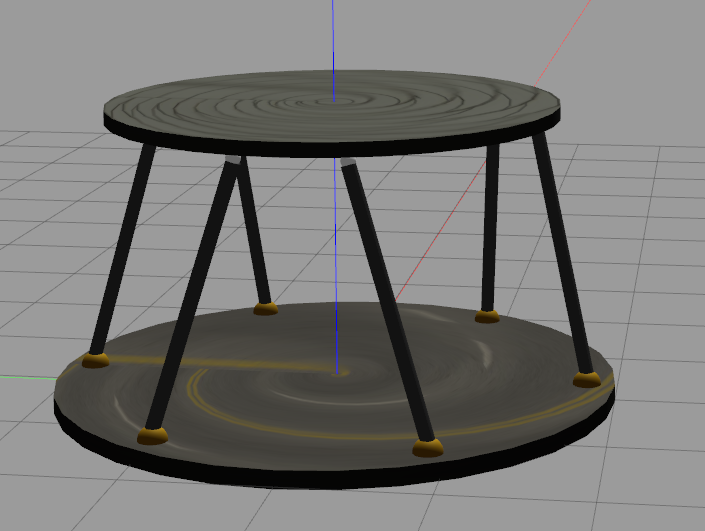

# Stewart Platform (Parallel Manipulator) — ROS 2 + Gazebo
## Platform Model Preview

<p align="center">
  
</p>
A ROS 2 package providing a **Stewart platform (6-DoF parallel manipulator)** model for Gazebo Classic and a minimal control stack.

- Gazebo SDF model + custom joint controller plugin
- ROS 2 inverse kinematics (IK) node: pose → leg lengths
- Optional sinusoidal command node for test motions

---

## Requirements

- ROS 2 Humble (Python **3.10** runtime)
- Gazebo **Classic** (gazebo11)
- Eigen3 (for C++ IK)
- `gazebo_ros_pkgs`

> Use the system Python 3.10 that ships with ROS 2 Humble. Do **not** run nodes under conda Python 3.13.

---

## Build

```bash
# from your ROS 2 workspace root
colcon build --packages-select stewart_platform
source install/setup.bash
